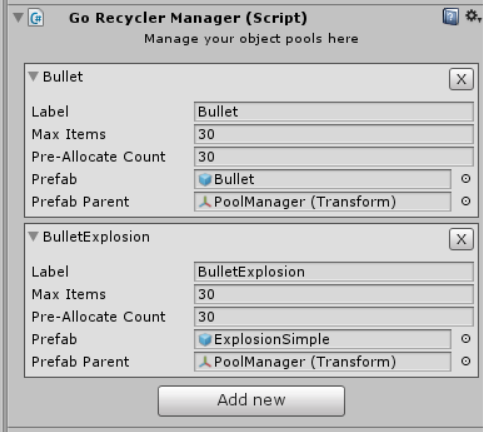

# GoRecycler
Object Pool Manager for Unity3d Game Engine. 



## Getting started

Add GoRecyclerManager to your scene:
* Create > Empty GameObject > AddComponent > RecyclerManager

### Get from Object Pool

```csharp
using UnityEngine;
using System.Collections;
using GoRecycler;

namespace ExampleNamespace
{
    public class ExampleClass : MonoBehaviour
    {
        public string PoolLabel;
        void Start ()
        {
            // it enables the gameObject by default
            GameObject bullet = RecyclerManager.Spawn(PoolLabel, transform.position, transform.rotation);
        }
    }
}
```

### Recycle to Object Pool

```csharp
using UnityEngine;
using System.Collections;
using GoRecycler;

namespace ExampleNamespace
{
    public class ExampleClass : MonoBehaviour
    {
        IEnumerator Start ()
        {
            yield return new WaitForSeconds(5);
            // it disables the gameObject by default
            gameObject.Recycle();
        }
    }
}
```

###  Check if the GameObject is on a Object Pool

```csharp 
using UnityEngine;
using System.Collections;
using GoRecycler;

namespace ExampleNamespace
{
    public class ExampleClass : MonoBehaviour
    {
        void OnEnable ()
        {
            bool inPool = gameObject.IsOnPool();
            if (inPool) Debug.Log("I'm on a Object Pool");
        }
    }
}
```

### Get the object pool asigned to the Game Object

```csharp
// RecycleBin is the object pool class that handles the Pool to a Prefab
RecycleBin recyclebin = RecyclerManager.GetRecycleBin(gameObject);
```