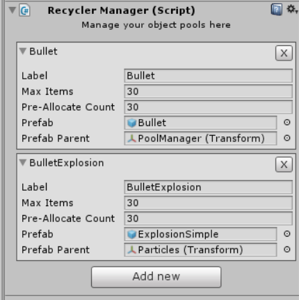

# GoRecycler
Object Pool Manager for unity 3d Game Engine. 



## Getting started

Add GoRecyclerManager to your scene:
* Create> Empy GameObject > AddComponent: GoRecyclerManager

### Get from Object Pool

```csharp
using UnityEngine;
using System.Collections;
using GoRecycler;

namespace ExampleNamespace
{
    public class ExampleClass : MonoBehaviour
    {
        public string PoolLabel;
        void Start ()
        {
            GameObject myPooledPrefab = GoRecyclerManager.Spawn(PoolLabel, transform.position, Quaternion.identity);
        }
    }
}
```